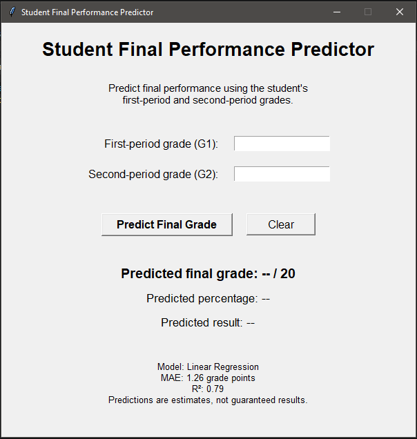
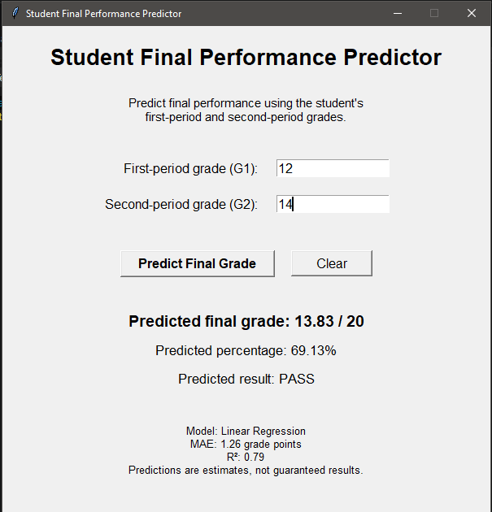

# 🎓 Student Final Performance Predictor

A Python-based machine learning application that predicts a student's final academic performance from their previous examination grades.

The project was developed progressively from a basic Linear Regression model into a complete ML workflow involving data preparation, model evaluation, algorithm comparison, error analysis, and a Tkinter graphical user interface.

---

## 📌 Overview

The **Student Final Performance Predictor** uses historical student performance data to predict a student's final grade (`G3`) from their first-period (`G1`) and second-period (`G2`) grades.

The project focuses on understanding the complete machine learning process rather than simply training a model:

```text
Dataset
   ↓
Feature Selection
   ↓
Train / Test Split
   ↓
Model Training
   ↓
Model Evaluation
   ↓
Algorithm Comparison
   ↓
Error Analysis
   ↓
Final Prediction Application
```

The final application allows a user to enter previous examination grades and receive an estimated final grade, percentage, and pass/fail result.

---

## ✨ Features

* Predict final student grade using Machine Learning
* Linear Regression based prediction
* Train/test data splitting
* MAE and R² model evaluation
* Comparison of multiple regression algorithms
* Feature experimentation
* Actual vs predicted visualization
* Prediction error analysis
* Identification of worst predictions
* Input validation
* Tkinter graphical user interface
* Displays model performance alongside predictions
* Multiple development versions preserved for comparison

---

## 🤖 Machine Learning Approach

### Input Features

The final model uses:

| Feature | Description         |
| ------- | ------------------- |
| `G1`    | First-period grade  |
| `G2`    | Second-period grade |

### Target

| Target | Description        |
| ------ | ------------------ |
| `G3`   | Final-period grade |

The grades in the dataset are represented on a **0–20 scale**.

The final prediction process is:

```text
G1 + G2
   ↓
Linear Regression
   ↓
Predicted G3
   ↓
Percentage conversion
   ↓
PASS / FAIL
```

---

## 📊 Dataset

This project uses the **Student Performance** dataset from the UCI Machine Learning Repository.

The mathematics dataset contains **395 student records** and includes academic, demographic, social, and school-related information.

Although the dataset contains many variables, the final model uses only `G1` and `G2`. Additional variables were tested during development to determine whether they improved prediction performance.

### Dataset Source

UCI Machine Learning Repository:

https://archive.ics.uci.edu/dataset/320/student+performance

Dataset attribution and licensing information should be followed separately from the license applied to this project's source code.

---

# 🧪 Model Experiments

A major part of the project was comparing different feature sets rather than simply accepting the first working model.

## Feature Experiment

### Model 1

```text
G1 + G2 → G3
```

| Metric |   Result |
| ------ | -------: |
| MAE    | **1.26** |
| R²     | **0.79** |

### Model 2

```text
G1 + G2 + Studytime → G3
```

| Metric |   Result |
| ------ | -------: |
| MAE    |     1.27 |
| R²     | **0.80** |

### Model 3

```text
G1 + G2 + Studytime + Failures + Absences → G3
```

| Metric | Result |
| ------ | -----: |
| MAE    |   1.34 |
| R²     |   0.78 |

### Conclusion

The additional tested features did not produce a meaningful improvement in prediction error.

The simplest feature set, **G1 + G2**, achieved the lowest MAE and was therefore selected for the final predictor.

---

# 🔬 Algorithm Comparison

Three regression algorithms were evaluated using the same train/test split.

| Model                   |    MAE ↓ |     R² ↑ |
| ----------------------- | -------: | -------: |
| **Linear Regression**   | **1.26** | **0.79** |
| Decision Tree Regressor |     1.40 |     0.76 |
| Random Forest Regressor |     1.36 |     0.76 |

### Selected Model

**Linear Regression**

It achieved the lowest MAE and the highest R² among the tested models.

This project therefore demonstrates that a more complicated model is not automatically a better model for a particular dataset.

---

# 📈 Model Evaluation

The final Linear Regression model was evaluated on a held-out test set.

### Mean Absolute Error — MAE

```text
MAE = 1.26 grade points
```

This means the model's predictions were off by approximately **1.26 grade points on average in absolute terms** on the test data.

### R² Score

```text
R² = 0.79
```

The model achieved an R² of 0.79 on the held-out test set.

R² is used together with MAE to evaluate the model rather than treating it as a percentage accuracy measure.

---

# 📉 Error Analysis

The project also examined individual prediction errors rather than relying only on aggregate metrics.

The actual-vs-predicted graph showed that most predictions were reasonably close to the ideal prediction relationship.

The model struggled particularly with several students whose recorded final grade (`G3`) was `0`, despite having substantially higher previous grades.

This showed an important limitation of the selected feature set:

```text
G1 + G2
```

does not contain enough information to explain every unusual final outcome.

The error analysis was therefore used to understand **where and why the model makes mistakes**, rather than simply reporting its overall score.

---

# 🖥️ Application

The final version uses **Tkinter** to provide a graphical interface.

### User Input

```text
First-period grade (G1)
Second-period grade (G2)
```

### Output

```text
Predicted final grade
Predicted percentage
PASS / FAIL
Model
MAE
R²
```

### Example

For:

```text
G1 = 12
G2 = 14
```

the model produced approximately:

```text
Predicted final grade : 13.83 / 20
Predicted percentage  : 69.13%
Predicted result      : PASS
Typical prediction error: ±1.26 grade points
```

The prediction is an estimate and is not guaranteed to represent an individual student's actual final result.

---

# 🖼️ Screenshots

### Application Dashboard



### Prediction Result



---

# 🛠️ Technologies Used

* **Python 3**
* **Pandas** — data loading and manipulation
* **Scikit-learn** — machine learning and model evaluation
* **Matplotlib** — data visualization
* **Tkinter** — graphical user interface

---

# 📁 Project Structure

```text
student-final-performance-predictor/
│
├── main.py                  # Final Tkinter application
├── v1_model.py              # V1: basic ML prediction model
├── v2_analysis.py           # V2: experiments and model comparison
├── v3_terminal.py           # V3: terminal-based predictor
│
├── requirements.txt         # Required Python packages
├── .gitignore
├── LICENSE
├── README.md
│
└── screenshot/
    ├── dashboard.PNG
    └── result.PNG
```

---

# 🚀 Installation

Clone the repository:

```bash
git clone https://github.com/Tanishq9051/student-final-performance-predictor.git
```

Enter the project directory:

```bash
cd student-final-performance-predictor
```

Install the required packages:

```bash
pip install -r requirements.txt
```

Download the `student-mat.csv` file from the UCI Student Performance dataset and place it in the project directory.

Run the final application:

```bash
python main.py
```

---

# 🧪 Development Versions

The project was developed progressively.

| Version   | Description                                                             |
| --------- | ----------------------------------------------------------------------- |
| **V1**    | Basic Linear Regression model and prediction                            |
| **V2**    | Feature experiments, model comparison, visualization and error analysis |
| **V3**    | Terminal-based user prediction application                              |
| **Final** | Tkinter GUI application                                                 |

Keeping the development versions demonstrates how the project evolved rather than presenting the final code as a single step.

---

# 📚 Learning Outcomes

Through this project I learned:

* Fundamentals of supervised machine learning
* Regression and numerical prediction
* Features and target variables
* Train/test data splitting
* Linear Regression
* Model coefficients and intercept
* Model evaluation using MAE and R²
* Comparing different machine learning algorithms
* Feature experimentation
* Prediction error analysis
* Data visualization using Matplotlib
* Data handling using Pandas
* Building a GUI with Tkinter
* Understanding model limitations
* Converting an ML model into a usable application

---

# ⚠️ Limitations

This project is an educational machine learning application.

The model was evaluated using one held-out test split of the UCI dataset. Its results should not be interpreted as a guarantee that the same performance will occur on other schools, populations, or examination systems.

The model also identifies statistical relationships rather than proving causal relationships.

In particular, previous grades alone cannot explain exceptional outcomes such as some students whose final recorded grade was `0`.

The model should therefore be treated as a **prediction aid**, not a guaranteed prediction of an individual student's future performance.

---

# 👤 Author

**Tanishq Hardeniya**

Independent Python / Machine Learning Project

---

# 📄 License

The source code in this repository is released under the **MIT License**.

The UCI Student Performance dataset is subject to its own licensing and attribution requirements.
